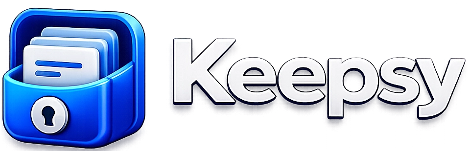

<div align="center">



### Save Everything. Find Anything.

A premium, privacy-first Chrome extension for capturing and organizing everything that matters — links, notes, emails, wallets, code, and more — without ever leaving your browser.

</div>

---

## Overview

Keepsy is a Manifest V3 Chrome extension that lives in your toolbar. Right-click anything on the web — a selection, a page, a link — and save it in one click. Everything is stored **locally in your browser**; nothing is ever sent to an external server.

It's built to feel like a small, focused productivity app: fast to open, fast to search, and designed with the same attention to detail as the best modern productivity tools.

## Features

### Capture
- **Right-click capture** — save a selection, the current page, or a link from any site's context menu
- **Smart type detection** — automatically recognizes emails, phone numbers, URLs, YouTube links, and crypto wallet addresses as you type or capture
- **10 item types** — Note, Email, Phone, Website, YouTube, Crypto Wallet, API Key, Code, Address, Custom
- **Smart YouTube previews** — auto-fetches video title, thumbnail, and channel name
- **Custom icons** — upload your own icon per item, with automatic compression and a fallback to a branded default icon per type

### Organize
- **Collections** — group items into folders, with a smooth horizontal-scrolling filter bar
- **Categories & Tags** — fully custom taxonomies with inline creation, rename, and delete (with safe cascading updates to affected items)
- **Smart color labels** — categories and collections get consistent, deterministic colors across the whole app, so you recognize them at a glance
- **Favorites & Pinning** — surface what matters most
- **Bulk actions** — multi-select to move, tag, collect, or trash items at once

### Find
- **Instant search** across titles, tags, categories, collections, and content
- **Filters & sorting** — by type, category, tag, favorite/pinned status, newest/oldest/recently-updated/A–Z
- **Trash with undo** — nothing is ever deleted by accident; a 6-second undo window follows every delete, with a full Trash view behind it

### Personalize
- **Onboarding walkthrough** — a short, skippable welcome flow for first-time users, replayable anytime from Settings
- **Deep Settings** — default home view & sort order, confirm-before-delete, auto-empty-trash schedule, compact density mode, animation toggle, full JSON backup/restore, storage usage, and more
- **Mini Games** — a lightweight, lazy-loaded bonus feature tucked away in Settings for a quick 30-second break (currently: *Tap the Dot*)

## Screenshots

<div align="center">

</div>

## Tech Stack

| | |
|---|---|
| **Framework** | React 19 + TypeScript |
| **Build** | Vite |
| **Styling** | Tailwind CSS |
| **Animation** | Framer Motion |
| **Icons** | Lucide React, Simple Icons, cryptocurrency-icons |
| **Platform** | Chrome Extension, Manifest V3 |
| **Storage** | `chrome.storage.local` (with a `localStorage` fallback for browser-only development) |

No backend, no analytics, no external API calls beyond the optional YouTube oEmbed lookup — everything else is 100% local.

## Getting Started

### Prerequisites
- [Node.js](https://nodejs.org/) 18+
- Google Chrome (or any Chromium-based browser)

### Install & build

```bash
git clone <this-repo-url>
cd keepsy-chrome-extension
npm install
npm run build
```

This produces a `dist/` folder ready to load as an unpacked extension.

### Load into Chrome

1. Open `chrome://extensions`
2. Enable **Developer mode** (top right)
3. Click **Load unpacked** and select the `dist/` folder
4. Pin Keepsy to your toolbar and you're set

### Development

```bash
npm run dev
```

Runs the popup UI in a regular browser tab via Vite's dev server for fast iteration. Note that Chrome-only APIs (context menu capture, favicon lookups, `chrome.storage`) aren't available outside a loaded extension — the app gracefully falls back to `localStorage` in that mode so the UI remains fully testable, but end-to-end capture flows should be verified as an unpacked extension.

```bash
npm run preview   # preview the production build
```

## Project Structure

```
├── public/
│   └── manifest.json        Chrome extension manifest (MV3)
├── src/
│   ├── background.ts        Service worker: context menus, capture detection
│   ├── App.tsx               Main popup UI
│   ├── components/           UI components (cards, forms, modals, Settings...)
│   │   └── ui/                Reusable primitives (Button, Modal, Switch...)
│   ├── games/                 Isolated, lazy-loaded Mini Games
│   │   └── tap-the-dot/         "Tap the Dot" game
│   ├── hooks/                 Data hooks (items, collections)
│   ├── lib/                   Storage, taxonomy, color labels, settings, helpers
│   └── types.ts               Shared type definitions
└── vite.config.ts
```

## Privacy

Everything Keepsy stores lives in your browser's local extension storage. There is no account, no sync server, and no tracking. The only outbound network request the extension ever makes is an optional, unauthenticated lookup to YouTube's public oEmbed endpoint when you save a YouTube link — used purely to fetch that video's title, thumbnail, and channel name.

## Developed by

[**THINXIFY.COM**](https://thinxify.com)
